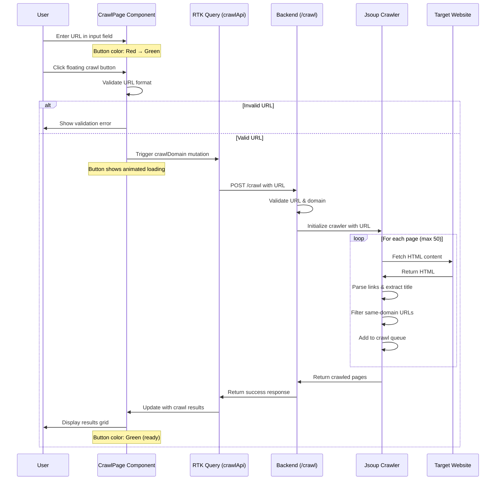

```mermaid
sequenceDiagram
    participant U as User
    participant UI as CrawlPage Component
    participant API as RTK Query (crawlApi)
    participant BE as Backend (/crawl)
    participant J as Jsoup Crawler
    participant Web as Target Website

    U->>UI: Enter URL in input field
    Note over UI: Button color: Red → Green
    U->>UI: Click floating crawl button
    UI->>UI: Validate URL format
    alt Invalid URL
        UI->>U: Show validation error
    else Valid URL
        UI->>API: Trigger crawlDomain mutation
        Note over UI: Button shows animated loading
        API->>BE: POST /crawl with URL
        BE->>BE: Validate URL & domain
        BE->>J: Initialize crawler with URL
        
        loop For each page (max 50)
            J->>Web: Fetch HTML content
            Web->>J: Return HTML
            J->>J: Parse links & extract title
            J->>J: Filter same-domain URLs
            J->>J: Add to crawl queue
        end
        
        J->>BE: Return crawled pages
        BE->>API: Return success response
        API->>UI: Update with crawl results
        UI->>U: Display results grid
        Note over UI: Button color: Green (ready)
    end
```