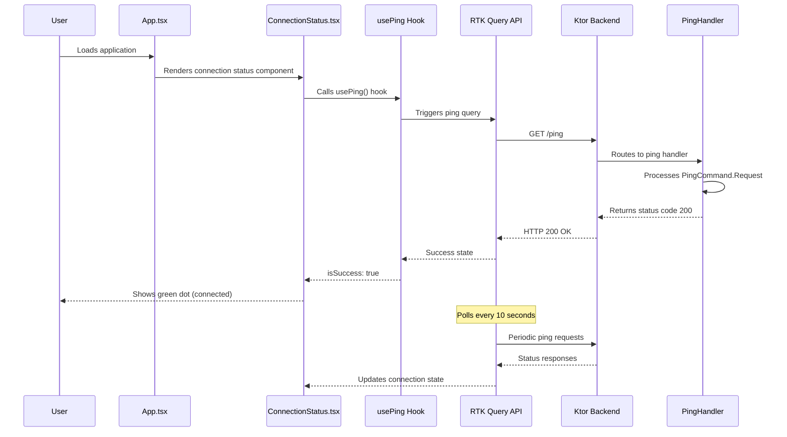

# Ping Feature Flow

This diagram documents the ping connectivity feature's architecture and user flow.

## Feature Flow Diagram



## Architecture Overview

```mermaid
graph TB
    subgraph "Frontend (React)"
        A[App.tsx] --> B[ConnectionStatus.tsx]
        B --> C[usePing Hook]
        C --> D[RTK Query API]
    end
    
    subgraph "Backend (Ktor)"
        E[/ping Route] --> F[PingHandler]
        F --> G[PingCommand.Request]
    end
    
    D -->|HTTP GET /ping| E
    E -->|200 OK| D
    
    style B fill:#e1f5fe
    style F fill:#f3e5f5
    style D fill:#e8f5e8
```

## Component Responsibilities

- **App.tsx**: Main application container with header layout
- **ConnectionStatus.tsx**: Visual indicator (red/green dot) for backend connectivity
- **usePing Hook**: Wrapper around RTK Query for clean component usage
- **RTK Query API**: Handles HTTP requests and caching
- **PingHandler**: Backend handler that processes ping commands
- **PingCommand**: Domain command representing a connectivity check

## Key Features

- Automatic polling every 10 seconds
- Visual feedback with color-coded status dot
- Error handling for network failures
- Minimal UI impact (small dot in header)
- Type-safe communication between frontend and backend
