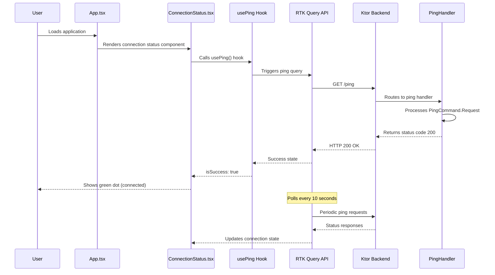

```mermaid
sequenceDiagram
    participant User
    participant App as App.tsx
    participant ConnectionStatus as ConnectionStatus.tsx
    participant usePing as usePing Hook
    participant RTKQuery as RTK Query API
    participant Backend as Ktor Backend
    participant PingHandler as PingHandler

    User->>App: Loads application
    App->>ConnectionStatus: Renders connection status component
    ConnectionStatus->>usePing: Calls usePing() hook
    usePing->>RTKQuery: Triggers ping query
    RTKQuery->>Backend: GET /ping
    Backend->>PingHandler: Routes to ping handler
    PingHandler->>PingHandler: Processes PingCommand.Request
    PingHandler-->>Backend: Returns status code 200
    Backend-->>RTKQuery: HTTP 200 OK
    RTKQuery-->>usePing: Success state
    usePing-->>ConnectionStatus: isSuccess: true
    ConnectionStatus-->>User: Shows green dot (connected)
    
    Note over RTKQuery: Polls every 10 seconds
    RTKQuery->>Backend: Periodic ping requests
    Backend-->>RTKQuery: Status responses
    RTKQuery-->>ConnectionStatus: Updates connection state
```